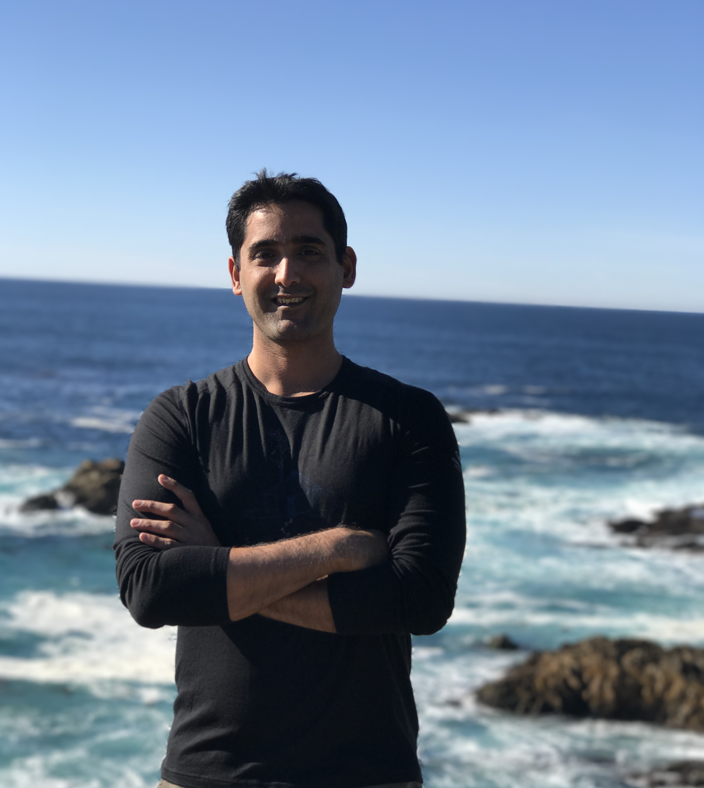

# Bio

Upkar Lidder is senior software product manager with 10+ years in IT development including team management, functional and technical leadership roles with a deep experience in full stack technology. Deep knowledge of digital security products and technologies and in developing large scale distributed cloud platforms. Currently working in the security domain focused on Cloud Native space. He can be seen speaking at various conferences and participating in local tech groups and meetups. Upkar went to graduate school in Canada and currently resides in the United States.

Personal Interests

- [x] Hiking and biking around the bay area
- [x] Tennis, Golf and Yoga
- [x] Learning new technonogies
- [x] ☕ and 🍻
 

[More pictures](/pictures)

